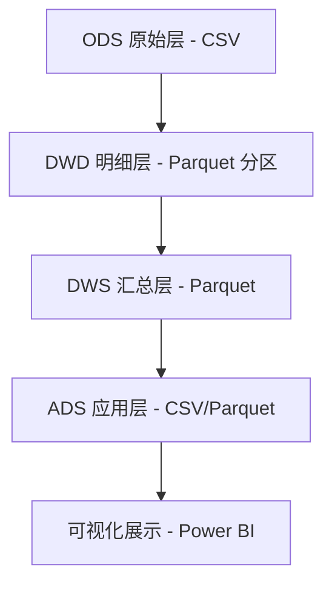

# 数据架构设计文档

本文件定义了电商行为数据分析系统的数仓分层架构、数据流向及各层表结构设计。

---

## 1. 总体架构

本系统采用经典的数据仓库四层架构，所有数据存储在本地 `data/` 目录下。

---

## 2. 数仓分层详述

### 2.1 ODS 层 (Operational Data Store)
- **存储路径**：`data/raw/`
- **数据形态**：原始 CSV 文件。
- **表结构**：同原始数据集字段。

### 2.2 DWD 层 (Data Warehouse Detail)
- **存储路径**：`data/dwd/`
- **核心表**：`dwd_user_behavior`
- **处理逻辑**：
    - 类型转换：`event_time` 转换为 `TimestampType`。
    - 派生字段：增加 `dt` (日期) 分区字段。
    - 质量清洗：过滤 `price <= 0` 的非法数据（标记或剔除），去除重复记录。
    - 存储格式：Parquet。
- **分区策略**：按 `dt` (YYYY-MM-DD) 分区。

### 2.3 DWS 层 (Data Warehouse Summary)
- **存储路径**：`data/dws/`
- **核心表**：
    - `dws_user_daily_stat`：用户日粒度行为汇总。
    - `dws_product_daily_stat`：商品日粒度行为汇总。
- **处理逻辑**：按天、用户、商品等维度进行轻度聚合。

### 2.4 ADS 层 (Application Data Service)
- **存储路径**：`data/ads/`
- **核心结果**：
    - `ads_funnel_convert_rate`：转化漏斗指标。
    - `ads_user_retention_matrix`：留存分析矩阵。
    - `ads_rfm_segmentation`：用户分层结果。
- **处理逻辑**：面向具体业务问题的深度聚合，直接对接可视化工具。

---

## 3. 数据流向示例 (以 DWD 为例)

| 原始字段 | DWD 字段 | 类型转换 | 说明 |
| :--- | :--- | :--- | :--- |
| event_time | event_time | String -> Timestamp | 统一时间格式 |
| - | dt | Date | 派生分区字段，格式 YYYY-MM-DD |
| price | price | Double | 保持不变，过滤非正数 |
| brand | brand | String | 保持不变，保留 NULL |

---

## 4. 存储优化策略

- **列式存储**：全线使用 Parquet 格式，利用其高效的压缩比和列裁剪特性。
- **分区过滤**：DWD 层引入 `dt` 分区，利用谓词下推（Predicate Pushdown）加速日期筛选。
- **Schema 约束**：所有读取操作必须显式指定 Schema，避免 `inferSchema` 带来的性能损耗。
